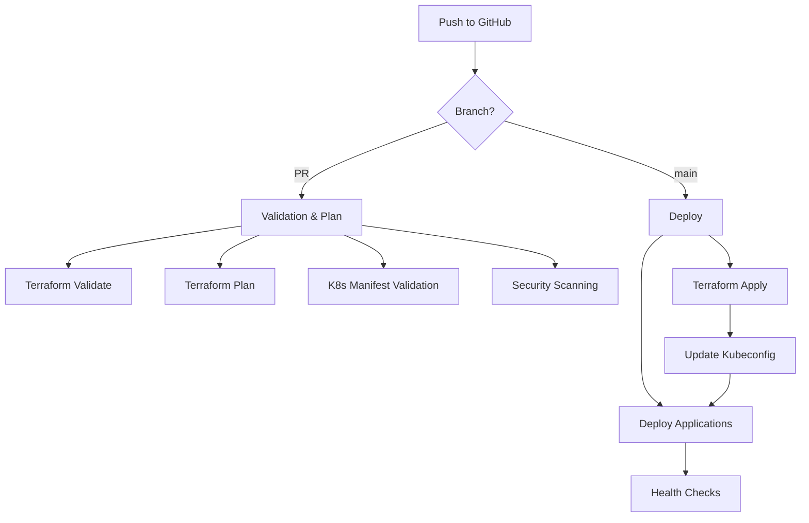

# CI/CD Pipeline Setup Guide

## Overview
This repository implements a complete GitOps workflow with GitHub Actions for managing both infrastructure and applications on the k3s cluster.

## Pipeline Architecture



## Workflows

### 1. Infrastructure Pipeline (`infrastructure.yml`)
- **Triggers**: Changes to Terraform files, Packer configs, or manifests
- **PR Actions**: 
  - Validates Terraform configuration
  - Runs `terraform plan` and posts results to PR
  - Checks formatting
- **Main Branch Actions**:
  - Applies Terraform changes automatically
  - Updates cluster infrastructure
  - Saves kubeconfig for app deployments

### 2. Application Deployment (`applications.yml`)
- **Triggers**: Changes to `apps/` or `k8s/` directories
- **PR Actions**:
  - Validates all Kubernetes manifests
  - Dry-run deployment check
- **Main Branch Actions**:
  - Deploys core services (StackGres, Qdrant, NodeLocal DNS)
  - Deploys applications
  - Monitors rollout status
  - Runs health checks

### 3. Security Scanning (`security.yml`)
- **Triggers**: All PRs, main pushes, and weekly schedule
- **Scans**:
  - Terraform security with Checkov
  - Container vulnerability scanning with Trivy
  - Secret detection with TruffleHog
  - Dependency checking

## Setting Up GitHub Secrets

You need to configure the following secrets in your GitHub repository:

### Required Secrets

1. **Navigate to Repository Settings**
   ```
   https://github.com/jakenelwood/consigliere-dev-pack/settings/secrets/actions
   ```

2. **Add These Secrets**:

   | Secret Name | Value | How to Get It |
   |------------|-------|---------------|
   | `HCLOUD_TOKEN` | Your Hetzner Cloud API token | From terraform.tfvars: `grep hcloud_token terraform.tfvars` |
   | `SSH_PRIVATE_KEY` | ED25519 private key | `cat ~/.ssh/id_ed25519` |
   | `SSH_PUBLIC_KEY` | ED25519 public key | `cat ~/.ssh/id_ed25519.pub` |
   | `KUBECONFIG` | Cluster kubeconfig | `cat ~/.kube/config-ai-consigliere` |

### Quick Commands to Get Secret Values

```bash
# Get Hetzner token (be careful - this is sensitive!)
cd /home/brian/Dev/consigliere-dev-pack
grep hcloud_token terraform.tfvars | cut -d'"' -f2

# Get SSH private key
cat ~/.ssh/id_ed25519

# Get SSH public key  
cat ~/.ssh/id_ed25519.pub

# Get kubeconfig
cat ~/.kube/config-ai-consigliere
```

## Directory Structure

```
consigliere-dev-pack/
├── .github/workflows/
│   ├── infrastructure.yml  # Infrastructure CI/CD
│   ├── applications.yml    # Application deployment
│   └── security.yml        # Security scanning
├── apps/                   # Application-specific manifests
├── k8s/                    # General Kubernetes manifests
├── manifests/             # Core service manifests
└── values/                # Helm chart values
```

## Deployment Flow

### For Infrastructure Changes

1. Create PR with Terraform changes
2. Review the plan posted as PR comment
3. Merge PR to main
4. Infrastructure automatically updates
5. New kubeconfig is saved

### For Application Deployment

1. Add manifests to `apps/` or `k8s/`
2. Create PR
3. Manifests are validated
4. Merge to main
5. Applications deploy automatically

### Manual Deployment

You can trigger deployments manually:
1. Go to Actions tab
2. Select "Application Deployment"
3. Click "Run workflow"
4. Choose environment

## Environment Protection

The `production` environment has protection rules:
- Requires approval for infrastructure changes
- Maintains deployment history
- Can add required reviewers

To configure:
1. Go to Settings → Environments
2. Click on "production"
3. Configure protection rules

## Monitoring Pipeline Status

### Badge for README
Add to your README.md:
```markdown


```

### Notifications
Set up notifications:
1. Go to Settings → Notifications
2. Configure email/Slack alerts for workflow failures

## Rollback Procedures

### Infrastructure Rollback
```bash
# Locally revert to previous state
cd /home/brian/Dev/consigliere-dev-pack
git revert HEAD
git push origin main
# Pipeline will apply previous configuration
```

### Application Rollback
```bash
# Use kubectl to rollback deployments
kubectl rollout undo deployment/app-name -n namespace
# Or revert the commit
git revert HEAD && git push
```

## Best Practices

1. **Always Test in PR First**
   - Never push directly to main
   - Review terraform plan output
   - Check security scan results

2. **Use Semantic Commit Messages**
   - `feat:` for new features
   - `fix:` for bug fixes
   - `docs:` for documentation
   - `infra:` for infrastructure changes

3. **Secret Management**
   - Never commit secrets
   - Use GitHub Secrets for sensitive data
   - Rotate secrets regularly

4. **Monitoring**
   - Check Actions tab regularly
   - Set up alerts for failures
   - Review security scan results

## Troubleshooting

### Pipeline Fails at Terraform Init
- Check HCLOUD_TOKEN secret is set correctly
- Verify SSH keys are properly configured

### Kubectl Commands Fail
- Update KUBECONFIG secret after cluster recreation
- Check cluster is accessible

### Security Scans Have Too Many Alerts
- Review and add exceptions for false positives
- Update skip_check in security.yml

## Local Testing

Test workflows locally with [act](https://github.com/nektos/act):
```bash
# Install act
brew install act  # or your package manager

# Test infrastructure workflow
act -W .github/workflows/infrastructure.yml --secret-file .env

# Test with specific event
act pull_request -W .github/workflows/infrastructure.yml
```

## Support

For issues with:
- **GitHub Actions**: Check [Actions Documentation](https://docs.github.com/actions)
- **Terraform**: See terraform.io documentation
- **Kubernetes**: Check k8s.io documentation
- **This Setup**: Open an issue in the repository

---

*Last Updated: August 27, 2025*